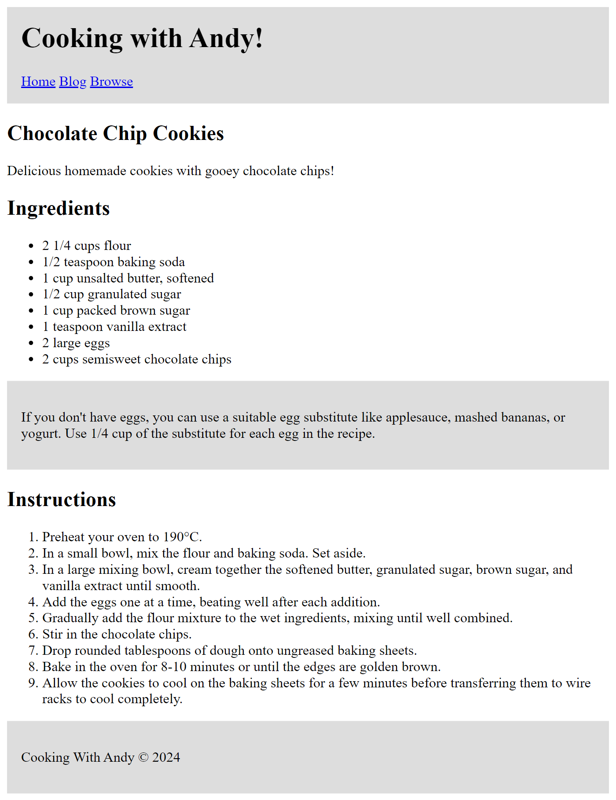

# Set Exercise 1: Semantic Markup

## Task

**For this Set Exercise, you must recreate the webpage shown in this screenshot. You must use semantic elements.**

A copy of the recipe used is provided in [recipe.md](recipe.md).

## How Will I be Marked?

For this exercise, you will be marked on the following:

- **Have you used a range of semantic elements for the text and structure of the page, and have you used them correctly? (elements such as `p`, `h1`, `section`, and so on!) Do elements have any expected attributes?**  
    If you are unsure what the semantic elements are, look back on the week 1 resources on Minerva.

- **Have you used the [standard HTML structure](https://www.w3schools.com/html/html_intro.asp) shown in class?**

- **Is your code clearly formatted, indented, and commented?**  
    *(Hint: Visual Studio Code can [format code automatically](https://code.visualstudio.com/docs/editor/codebasics#_formatting)!)*

- **Is your GitHub repository well organised and presented?**

To complete this exercise, you will need to understand the content taught during week 1. However, you may optionally earn extra marks by using additional techniques to extend your solution further.

You will not be marked for accuracy. In other words, it does not matter if there are typos or minor differences between your solution and the screenshot. **However**, you **must** include all the key elements shown in the screenshot. For example, if the screenshot contains an ordered list, your solution must contain one too.
