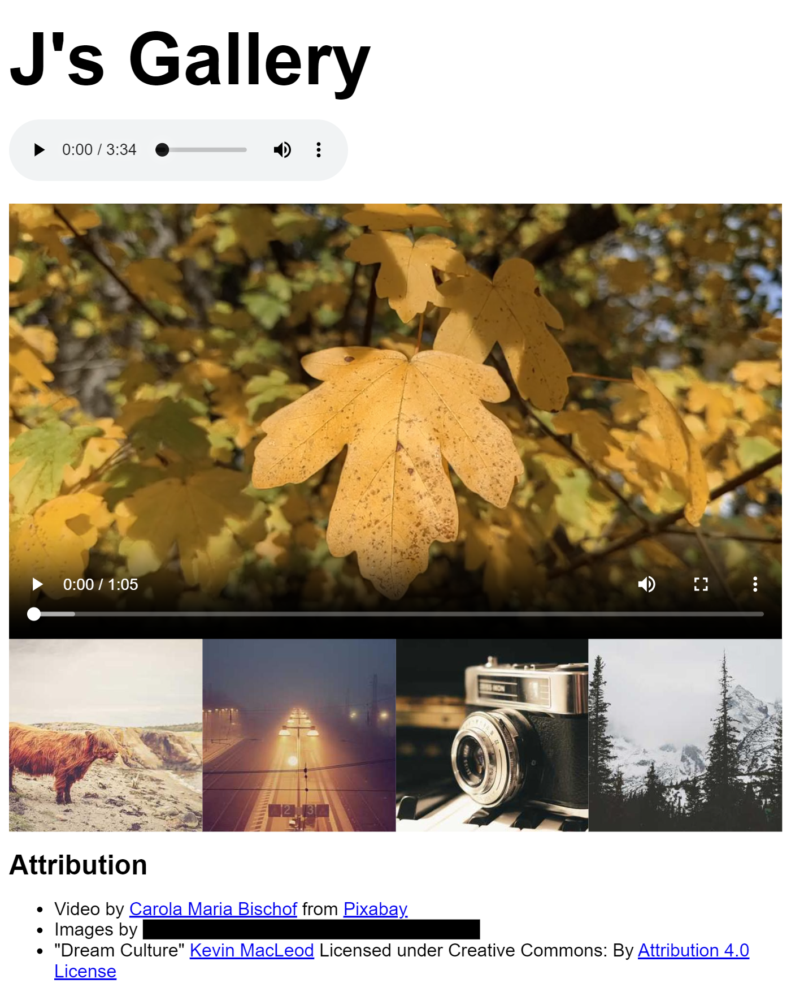

# Set Exercise 3: Rich Media

## Task

**For this Set Exercise, you must recreate the webpage shown in this screenshot. You must use multi-media elements.**

For this exercise, you must find your own image assets. A copy of the video and music assets used are provided in the [assets folder](assets).

## How Will I be Marked?

For this exercise, you will be marked on the following:

- **Have you added image, video, and audio, with all of the required attributes?**  
    If you are unsure about this, look back on the Week 4 resources on Minerva.

- **Have you only used assets that you would be legally allowed to use for a commercial project? Have you included any required credits or attributions?**  
    If you are unsure about this, look back on the week 4 resources on Minerva.

- **Have you arranged the images and videos as shown in the screenshot?**  
    There should be no gaps in between the images and the videos. At least four images should be arranged in a row.

- **Have you used the [standard HTML structure](https://www.w3schools.com/html/html_intro.asp) shown in class? Have you used semantic HTML elements?**  
    If you are unsure about this, look back on the week 1 resources on Minerva.

- **Is your code clearly formatted, indented, and commented?.**  
    *(Hint: Visual Studio Code can [format code automatically](https://code.visualstudio.com/docs/editor/codebasics#_formatting)!)*

- **Is your GitHub repository well organised and presented?**

To complete this exercise, you will need to understand the content taught during weeks 1-4. However, you may optionally earn extra marks by using additional techniques to extend your solution further.

You will not be marked for accuracy. In other words, it does not matter if there are typos or minor differences between your solution and the screenshot. **However**, you **must** include all the key elements shown in the screenshot. For example, in the screenshot, all of the images and videos have no gaps between them. This should be the case in your solution too.

## Assets Attribution

The video and music provided in the [assets folder](assets) were taken from various sources online. Here are the credits that should be included on any website that wishes to use those assets for free.

### [leaves.mp4](leaves.mp4)  
Video by <a href="https://pixabay.com/users/caromaria-37915556/?utm_source=link-attribution&utm_medium=referral&utm_campaign=video&utm_content=188021">Carola Maria Bischof</a> from <a href="https://pixabay.com//?utm_source=link-attribution&utm_medium=referral&utm_campaign=video&utm_content=188021">Pixabay</a>

### [dream-culture.mp3](dream-cultre.mp3)  
"Dream Culture" Kevin MacLeod (incompetech.com)
Licensed under Creative Commons: By Attribution 4.0 License
http://creativecommons.org/licenses/by/4.0/