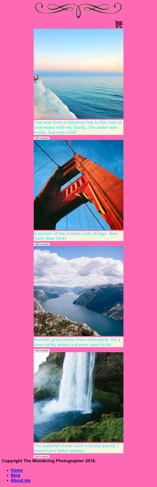

# Set Exercise 4: Web Accessibility

## Task

**The webpage shown in this screenshot has multiple accessibility issues. For this Set Exercise, you must recreate the a new version of the webpage that is more accessible.**

The page is from a travel photography blog, where users can buy high-quality prints of the photos shown. Users can add photographs to their basket using the button under each photo, and then check out using the shopping cart button. 

A copy of the text used is provided in [content.md](content.md). Copies of the images used are provided in the [assets folder](assets).

## How Will I be Marked?

For this exercise, you will be marked on the following:

- **Have you used key features of HTML/CSS to ensure content on the page is accessible visually *and* via a screen reader?**  
    If you are unsure about this, look back on the Week 4 resources on Minerva.

- **Have you used key features of HTML to ensure all interactions on the page can be accessed using different input devices?**  
    In this case, the 'interactions' are all the buttons and links on the page. If you are unsure about this, look back on the Week 4 resources on Minerva.

- **Have you used the [standard HTML structure](https://www.w3schools.com/html/html_intro.asp) shown in class? Have you used semantic HTML elements?**  
    If you are unsure about this, look back on the week 1 resources on Minerva.

- **Is your code clearly formatted, indented, and commented?**   
    *(Hint: Visual Studio Code can [format code automatically](https://code.visualstudio.com/docs/editor/codebasics#_formatting)!)*

- **Is your GitHub repository well organised and presented?**

To complete this exercise, you will need to understand the content taught during weeks 1-4. However, you may optionally earn extra marks by using additional techniques to extend your solution further.

You **must** include all the key elements shown in the screenshot. For example, if the screenshot contains buttons, your solution should too. However, as part of this exercise, we expect that your webpage will be different from the one in the screenshot.
